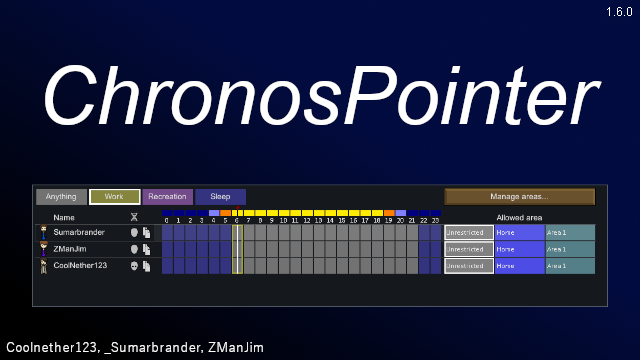

Portions of the materials used to create this content/mod are trademarks and/or copyrighted works of Ludeon Studios Inc. All rights reserved by Ludeon. This content/mod is not official and is not endorsed by Ludeon. 

<h1>Chronos Pointer - Schedule Menu Enhancement</h1>

Chronos Pointer adds several current-time indicators to RimWorld's Schedule tab.

## Features

- An hours bar above the schedule shows the day and night cycle.
- A moving arrow marks the current hour and minute.
- A cursor across the hours bar tracks the same time at a smaller scale.
- A full-height line carries the current time through every pawn's schedule row.
- Separate color controls cover the arrow, highlight, cursors, and bar segments.
- The hours bar can react to solar flares, eclipses, toxic fallout, volcanic winter, and auroras.

You can enable each indicator separately and adjust its appearance in the mod settings.
  
This mod requires [Harmony](https://steamcommunity.com/workshop/filedetails/?id=2009463077). It is safe to add to existing saves.

<h2>DLC and mod compatibility</h2>

<h3>DLC</h3>

[Royalty](https://rimworldgame.com/royalty/), [Ideology](https://rimworldgame.com/ideology/), [Biotech](https://rimworldgame.com/biotech/), and [Anomaly](https://rimworldgame.com/anomaly/) are supported. 

<h3>Mods</h3>

[Reading Schedule](https://steamcommunity.com/sharedfiles/filedetails/?id=3367570241&searchtext=Schedule+cursor), [Zone To Schedule](https://steamcommunity.com/sharedfiles/filedetails/?id=2436086611&searchtext=Zone+to+schedule), [1trickPwnyta's Defaults](https://steamcommunity.com/sharedfiles/filedetails/?id=3285178686), and [Grouped Pawns List](https://steamcommunity.com/sharedfiles/filedetails/?id=2340773428) are compatible. 
[Schedule Clock](https://steamcommunity.com/sharedfiles/filedetails/?id=3012379410) draws an overlapping line. Disable either mod's line to remove the overlap. 
[Custom Schedules](https://steamcommunity.com/sharedfiles/filedetails/?id=2717694491) overlaps part of the interface, but its buttons still work. 
