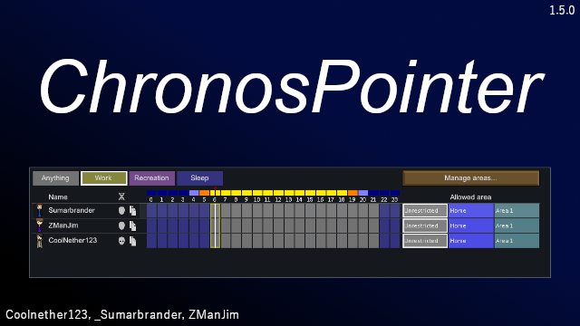

<h1>Chronos Pointer - Schedule Menu Enhancement</h1>

Enhances the schedule panel with dynamic time indicators for improved colony management and time tracking.

  Features: 
    - Day/Night Tracker: A bar above the hour numbers in the schedule window, visually representing day and night cycles. 
    - Dynamic Arrow: Moves in real-time, precisely indicating the current hour and minute. 
    - Day/Night Indicator: A small line at the arrow’s tip, spanning the width of the day/night tracker, tracing the passage of time. 
    - Full-Height Time Indicator: A vertical line spanning all pawns' schedules, moving in sync with the arrow to show the current time for all colonists at once. 
    - Customizable Colors: Adjust colors for the arrow, highlight, cursors, and bars to suit your preference. 
    - Incident Interactions: The Day/Night Tracker updates its color based on the map state for current events such as Solar Flare/Eclipse, and Auroras. 
 
  This mod provides an intuitive and visually appealing way to track time in RimWorld, making it easier to manage colonist schedules and activities throughout the day and night cycle.

  All features can be toggled and customized in the mod settings, allowing you to tailor the experience to your liking.
  
This mod requires [Harmony](https://steamcommunity.com/workshop/filedetails/?id=2009463077). It is safe to add to existing saves.

<h2>DLC/Mods Compatibility</h2>

<h3>DLC</h3>

[Royalty](https://rimworldgame.com/royalty/) - Supported 
[Ideology](https://rimworldgame.com/ideology/) - Supported 
[Biotech](https://rimworldgame.com/biotech/) - Supported 
[Anomaly](https://rimworldgame.com/anomaly/) - Supported 

<h3>Mods</h3>

[Reading Schedule](https://steamcommunity.com/sharedfiles/filedetails/?id=3367570241&searchtext=Schedule+cursor) - Native 
[Zone To Schedule](https://steamcommunity.com/sharedfiles/filedetails/?id=2436086611&searchtext=Zone+to+schedule) - Native 
[1trickPwnyta's Defaults](https://steamcommunity.com/sharedfiles/filedetails/?id=3285178686) - Native 
[Schedule Clock](https://steamcommunity.com/sharedfiles/filedetails/?id=3012379410) - Native. Line overlaps, can turn off Chronos Pointer's line to fix. 
[Grouped Pawns List](https://steamcommunity.com/sharedfiles/filedetails/?id=2340773428) - Native 
[Custom Schedules](https://steamcommunity.com/sharedfiles/filedetails/?id=2717694491) - UI Overlap; buttons still work. 